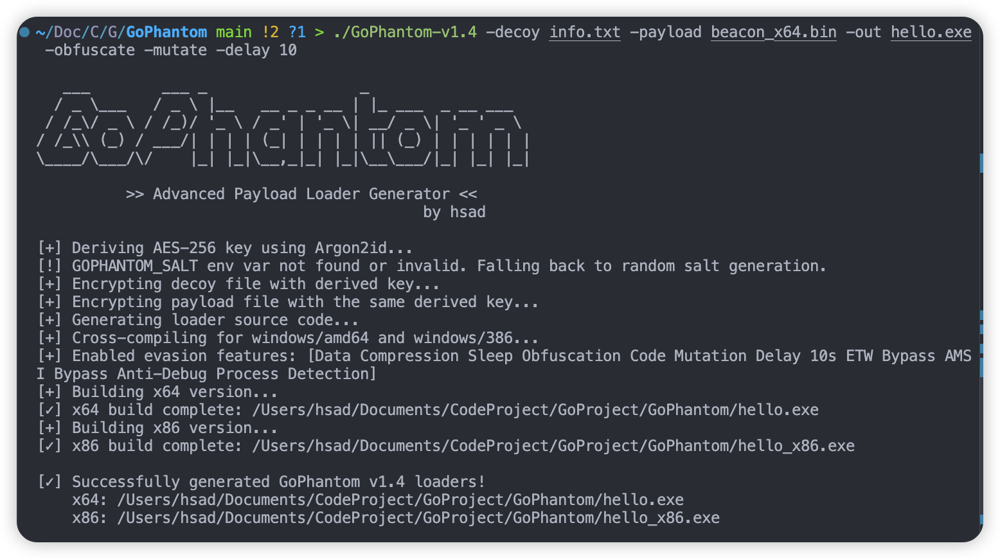

# GoPhantom

[](https://golang.org/)
[](https://www.microsoft.com/windows)
[](https://opensource.org/licenses/MIT)

**GoPhantom** 是一个为红队演练和安全研究设计的荷载加载器（Payload Loader）生成器。它利用 Go 语言将原始 Shellcode 和诱饵文件打包成具有一定免杀（AV-Evasion）能力的 Windows 可执行文件。

## 核心功能 (Core Features)

### 加密与混淆
* **多层加密**: XOR + zlib压缩 + AES-256-GCM三重保护
* **密钥派生**: 使用Argon2id从随机Salt派生AES-256密钥。注意：派生密码为编译时常量，Salt随样本嵌入，此设计目标是对抗静态特征扫描，而非提供密码学意义上的密钥保护
* **字符串混淆**: 所有敏感字符串（DLL名、API名、路径）编译时XOR编码，运行时解码，消除静态特征
* **Shellcode变异**: 可选的代码变异功能，使用多种等效NOP指令（6种变体）破坏静态特征
* **睡眠混淆**: Ekko-style权限翻转+加密的睡眠混淆，规避内存扫描
* **AMSI多态化**: AMSI patch在编译时随机选择等效方案，避免固定签名

### 免杀技术
* **NTDLL Unhooking**: 从磁盘读取干净ntdll.dll覆盖内存中被EDR hook的版本
* **内存权限分离**: 采用RW→RX内存操作模式，规避EDR行为检测
* **Nt系统调用**: 优先使用NtAllocateVirtualMemory/NtProtectVirtualMemory/NtCreateThreadEx绕过用户层Hook
* **ETW绕过**: 同时Patch EtwEventWrite和NtTraceEvent禁用事件追踪
* **AMSI绕过**: 多态化Patch AmsiScanBuffer绕过反恶意软件扫描接口
* **IAT伪装**: 导入合法Go标准库（net/http、os/user等），使PE导入表看起来像正常应用
* **API锤击**: 大量调用无害API消耗沙箱分析预算
* **分块内存复制**: 小块复制+随机延迟规避行为检测
* **最小权限注入**: 进程注入使用最小权限组合，降低EDR告警

### 反沙箱检测（加权评分制）

采用加权评分制而非 all-or-nothing，降低误杀率。每项检测按置信度分配权重，总分超过阈值（默认5分）才判定为沙箱：

| 权重 | 检测项 | 说明 |
|------|--------|------|
| 高(3) | 调试器检测 | IsDebuggerPresent、RemoteDebugger、NtGlobalFlag |
| 高(3) | VM注册表 | VirtualBox/VMware Guest Additions |
| 高(3) | 分析工具 | x64dbg、Wireshark、ProcessHacker等进程 |
| 高(3) | 硬件断点 | Dr0-Dr3寄存器检测 |
| 中(2) | 硬件规格 | CPU核心数、内存、磁盘空间 |
| 中(2) | 网络特征 | VM MAC地址前缀 |
| 中(2) | 系统状态 | 启动时间、Sleep加速 |
| 低(1) | 环境特征 | 进程数、分辨率、最近文件、已安装程序等 |

### 实用功能
* **诱饵文件**: 支持PDF、图片、文档等格式，提高社工攻击成功率
* **延迟执行**: 支持自定义延迟秒数，分段随机延迟规避检测
* **数据压缩**: zlib压缩可减少20-30%的文件体积
* **纯Go实现**: 无CGO依赖，保证跨平台编译兼容性

## 使用方法 (Usage)

### 二进制版本使用

```bash
./GoPhantom -decoy <诱饵文件> -payload <荷载文件> -out <输出文件> [选项]

必需参数:
  -decoy     诱饵文件路径 (PDF、图片、文档等)
  -payload   x64 shellcode文件路径
  -out       输出可执行文件名

可选参数:
  -compress   启用数据压缩 (默认: true)
  -delay      延迟N秒后执行荷载 (默认: 0)
  -obfuscate  启用睡眠混淆
  -mutate     启用shellcode变异
  -inject     启用进程注入模式（注入到explorer.exe等合法进程）
```

### 使用示例

基本加载器生成：
```bash
./GoPhantom -decoy "document.pdf" -payload "beacon.bin" -out "loader.exe"
```

完整功能加载器：
```bash
./GoPhantom -decoy "image.jpg" -payload "shell_x64.bin" -out "advanced.exe" \
  -compress -obfuscate -mutate -inject -delay 30
```

### 源码编译

```bash
git clone https://github.com/watanabe-hsad/GoPhantom.git
cd GoPhantom
go build -ldflags "-s -w" -o GoPhantom generator.go
```

## 工作原理 (How it Works)

GoPhantom采用两阶段执行模式：**生成阶段**和**执行阶段**。

### 生成阶段 (Generator Phase)

在攻击机上运行生成器创建最终的加载器程序：

1. **数据预处理**: 读取shellcode和诱饵文件，进行XOR变换和zlib压缩
2. **Salt生成**: 自动生成16字节随机Salt(或从环境变量读取)
3. **密钥派生**: 使用Argon2id从固定密码+Salt派生32字节AES-256密钥
4. **多层加密**: 使用派生密钥和AES-256-GCM算法加密处理后的数据
5. **字符串编码**: 生成随机XOR密钥，对所有敏感字符串预编码
6. **AMSI多态**: 随机选择等效AMSI patch方案
7. **模板注入**: 将加密数据、编码字符串、patch字节嵌入Go加载器模板
8. **编译**: 编译为windows/amd64平台PE可执行文件

### 执行阶段 (Runtime Phase)

目标机器上的加载器执行流程：

1. **NTDLL脱钩**: 从磁盘读取干净ntdll覆盖被hook的版本
2. **防御绕过**: 执行ETW（含NtTraceEvent）和AMSI绕过
3. **环境检测**: 加权评分制反沙箱检测（≥5分判定为沙箱）
4. **API锤击**: 大量无害API调用消耗沙箱分析预算
5. **行为伪装**: 模拟正常程序行为 + IAT伪装
6. **密钥重建**: 从自身提取Salt，重新派生AES密钥
7. **数据解密**: 解密诱饵文件和shellcode数据
8. **诱饵展示**: 释放并打开诱饵文件转移用户注意力
9. **延迟执行**: 根据配置进行分段随机延迟
10. **内存准备**: 使用Nt*系统调用申请内存，分块复制shellcode
11. **可选处理**: 根据配置进行shellcode变异或睡眠混淆
12. **权限切换**: 将内存权限修改为RX，执行前二次检测调试器
13. **独立执行**: 优先NtCreateThreadEx创建新线程执行荷载

## 技术原理 (Technical Details)

### 加密流程
```
明文 → XOR变换 → zlib压缩 → AES-256-GCM加密 → Base64编码 → 嵌入模板
```

### 执行流程
```
NTDLL脱钩 → ETW/AMSI绕过 → 沙箱评分检测 → API锤击 → 行为伪装 →
解密诱饵 → 显示诱饵 → 延迟执行 → 解密荷载 → [变异] → Nt*内存操作 →
[睡眠混淆] → 二次调试检测 → NtCreateThreadEx执行
```

## 高级配置 (Advanced Configuration)

### 可复现构建模式

通过手动指定Salt实现可复现构建，确保相同输入生成相同输出：

**生成自定义Salt:**
```bash
# Linux/macOS/Git Bash
echo 'package main; import "crypto/rand"; import "encoding/base64"; import "fmt"; func main() { b := make([]byte, 16); _, _ = rand.Read(b); fmt.Println(base64.StdEncoding.EncodeToString(b)) }' > temp_salt.go && go run temp_salt.go && rm temp_salt.go
```

**使用自定义Salt:**
```bash
# Linux/macOS
export GOPHANTOM_SALT="y5M3H+e8vU/HeaJg2w9bEA=="
./GoPhantom -decoy "info.txt" -payload "calc_x64.bin" -out "reproducible.exe"

# Windows PowerShell
$env:GOPHANTOM_SALT="y5M3H+e8vU/HeaJg2w9bEA=="
./GoPhantom -decoy "info.txt" -payload "calc_x64.bin" -out "reproducible.exe"
```

## 安装与使用 (Installation & Usage)

### 环境要求
* Go 1.21 或更高版本
* 支持交叉编译到Windows平台

### 快速开始

1. 克隆项目仓库：
   ```bash
   git clone https://github.com/watanabe-hsad/GoPhantom.git
   cd GoPhantom
   ```

2. 准备测试文件：
   - 将shellcode文件(如`beacon.bin`)放入项目目录
   - 准备诱饵文件(如`document.pdf`)

3. 生成加载器：
   ```bash
   # 源码方式
   go run generator.go -decoy "info.txt" -payload "calc_x64.bin" -out "hello.exe"
   
   # 二进制方式
   ./GoPhantom -decoy "info.txt" -payload "calc_x64.bin" -out "hello.exe"
   ```

## 演示截图 (Demo Screenshots)

### 生成过程


### 免杀效果


### 执行效果
在目标Windows机器上执行生成的loader：
- 自动打开诱饵文件转移注意力
- 后台静默执行shellcode荷载


## 项目结构 (Project Structure)

```
GoPhantom/
├── generator.go              # 生成器主程序
├── generator_test.go         # 模板编译测试
├── build/
│   ├── go.mod.tmpl           # 临时模块 go.mod
│   └── go.sum                # 临时模块 go.sum
├── templates/
│   ├── loader.go.tmpl        # 主模板（常量 + import + main）
│   ├── _structs.go.tmpl      # Windows 结构体定义
│   ├── _infra.go.tmpl        # DLL缓存 + 工具函数 + 字符串解码
│   ├── _bypass.go.tmpl       # NTDLL脱钩 + ETW/AMSI绕过
│   ├── _sandbox.go.tmpl      # 加权评分制反沙箱检测
│   ├── _crypto.go.tmpl       # AES-GCM解密函数
│   ├── _execute.go.tmpl      # Shellcode执行 + 进程注入
│   └── _camouflage.go.tmpl   # 行为伪装 + API锤击
├── internal/
│   └── keymgr/
│       └── keymgr.go         # 密钥管理模块
├── build.sh                  # 多平台编译脚本
├── image/                    # 演示截图
└── README.md                 # 项目文档
```

## 免责声明 (Disclaimer)

**此工具仅限于授权的渗透测试、安全研究和教育目的。**

严禁将此工具用于任何非法活动。本项目的作者不对任何因滥用或非法使用此工具而导致的直接或间接后果承担任何责任。用户应对自己的所有行为负责。

**使用本工具即表示您已阅读、理解并同意遵守此免责声明。**

---

## 支持项目 (Support)

如果这个项目对您有帮助，请考虑给个Star支持一下！

有问题或建议？欢迎提交Issue或Pull Request。

## Star History

[](https://www.star-history.com/#watanabe-hsad/GoPhantom&type=date&legend=top-left)

---

## 交流群 (Community)

欢迎加入QQ群交流讨论，一起探索红队技术！


